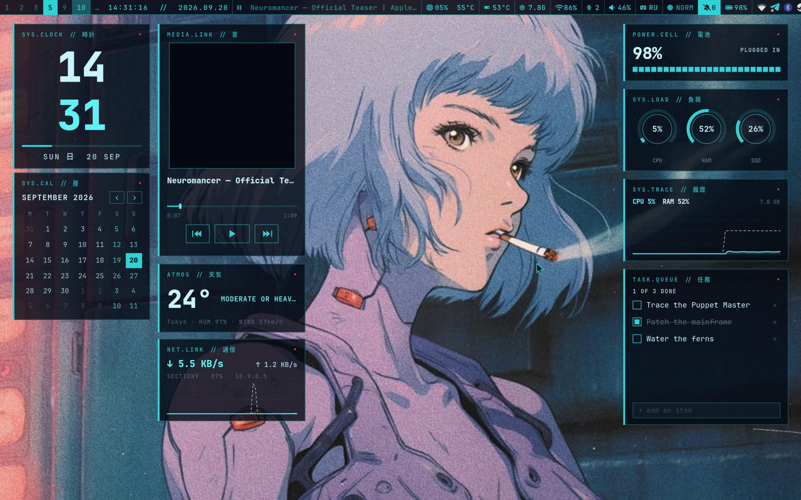
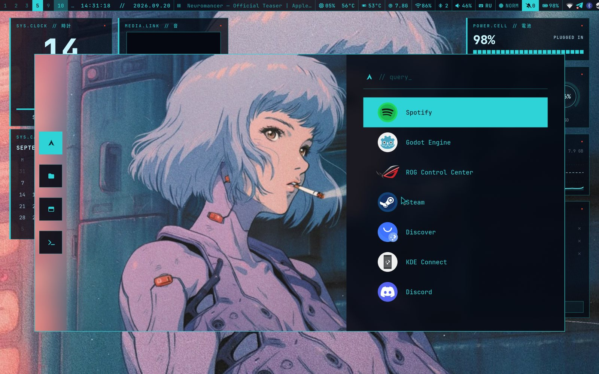
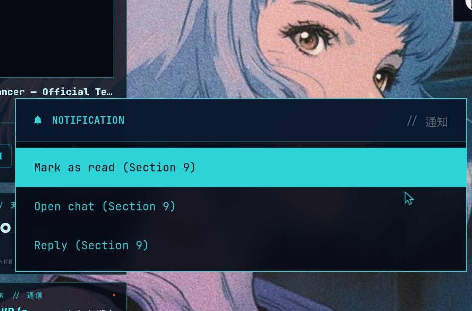
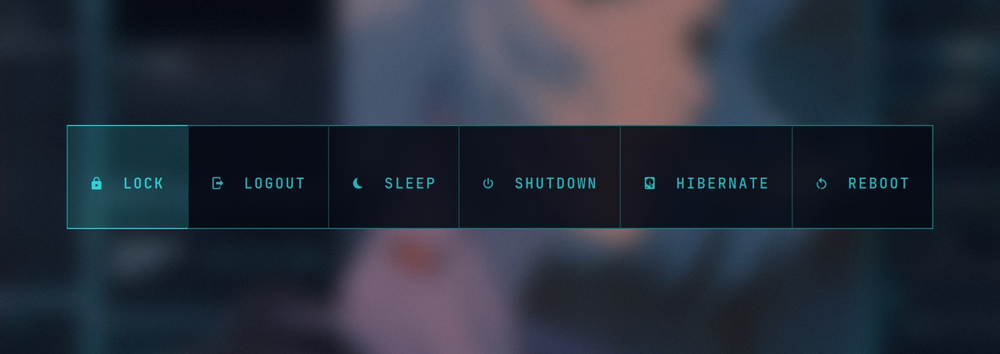
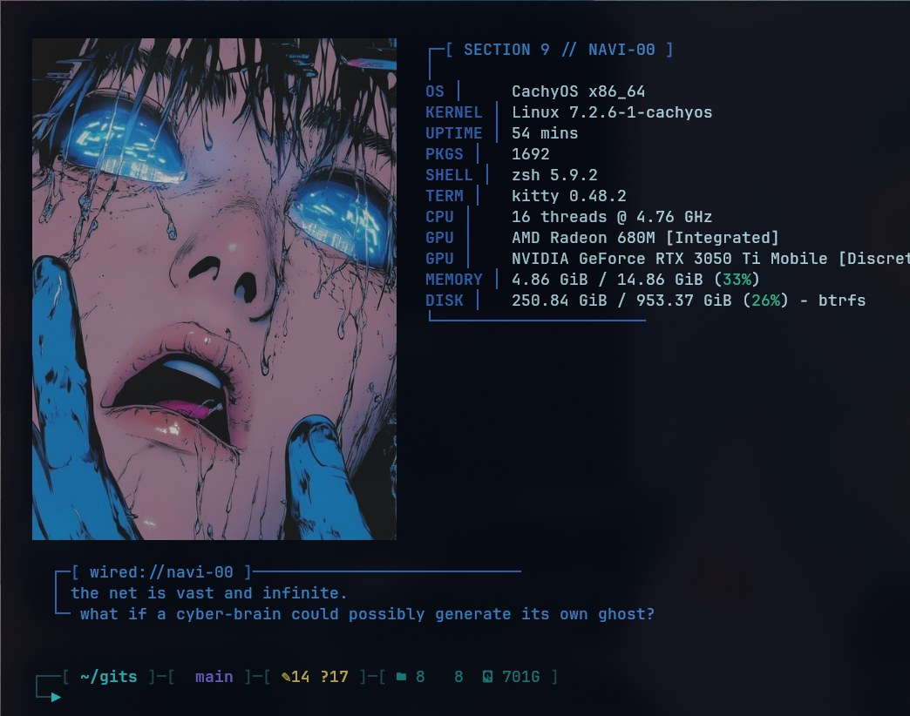
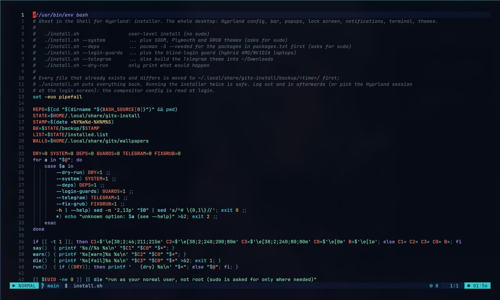
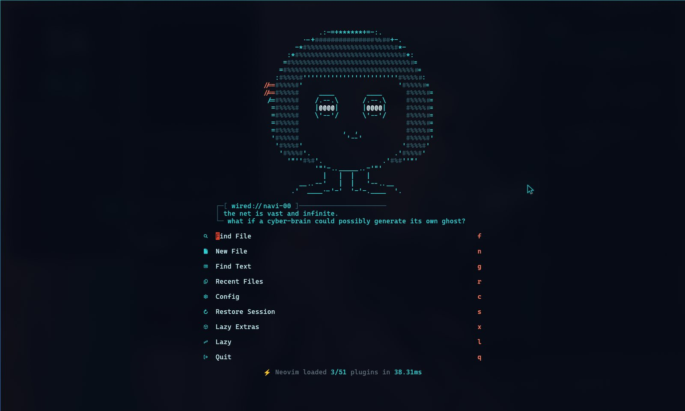
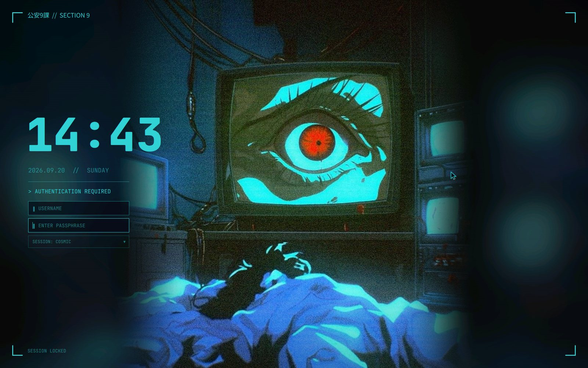
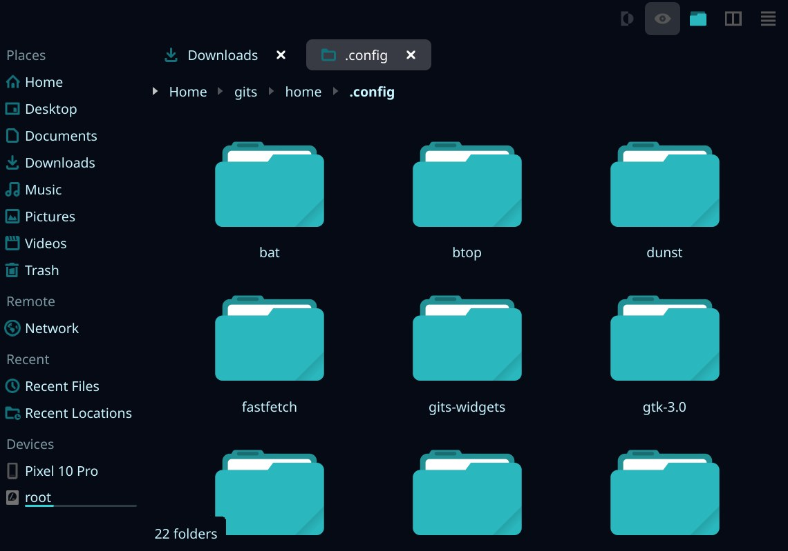
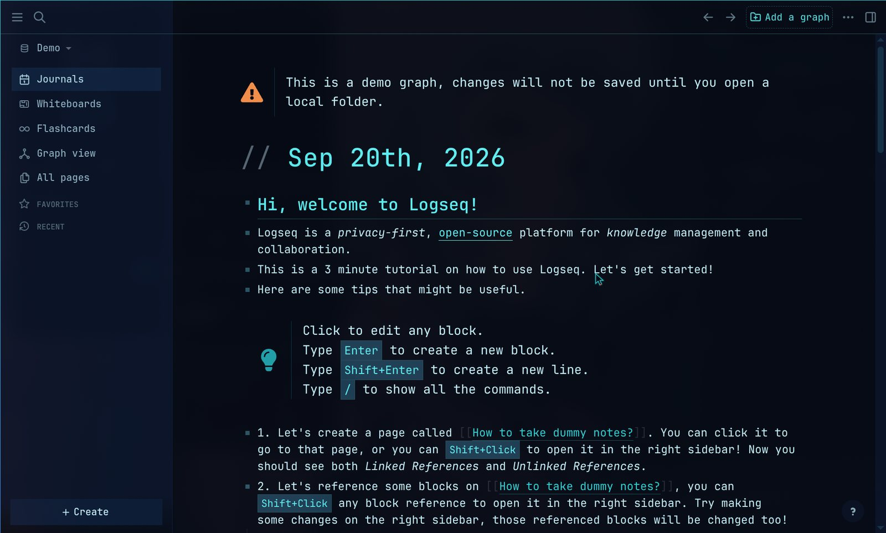

# gits-hyde — Ghost in the Shell for HyDE

A complete *Ghost in the Shell* desktop for [HyDE](https://github.com/HyDE-Project/HyDE) on Hyprland: navy + cyan
phosphor palette, square corners, thin frames, kanji tags. One installer, one uninstaller, every replaced file backed up.
[Русская версия](README.ru.md)

| Area | What you get |
|---|---|
| HyDE theme | `Ghost in the Shell`: palette, Hyprland look (sharp corners, cyan borders, blur), kitty, rofi, waybar colours, animation preset `gits` |
| Waybar | its own layout + style, one compact CPU/GPU/RAM module (details in the tooltip), power-profile module, language, notification counter, HyDE **workflow switcher**, crash watchdog |
| Desktop widgets | GTK4 layer-shell cards: clock, calendar, media player, weather, network, battery, CPU/RAM/SSD, history graph, to-do, **audio spectrum** (LED bars from the default sink, no cava), rare wallpaper glitch bursts (on AC only, `GITS_WIDGETS_GLITCH=0` disables) |
| Lock / login / boot | hyprlock layout, SDDM (Qt6) theme, Plymouth + GRUB themes |
| Animations | preset `gits`: windows lock in with a hard overshoot and collapse when closed, workspaces jump-cut; optional neon border runner (`touch ~/.local/state/gits-neon-border`, costs battery) |
| Launchers | rofi launcher (search prompt, square), wlogout, dunst, notification action menu, **Wi-Fi menu** (`gits-wifi`, bar click), **Bluetooth menu** (`gits-bt`), **power-profile menu** (bar module) |
| Popups | **control panel** (`gits-panel`, Super+Shift+C, the cog next to the power button: toggles, volume/brightness/keyboard sliders, power profile, charge limit, screenshot/OCR/picker/clipboard, lock/sleep/logout/reboot/off with confirmation), **player popup** (Super+Shift+M, click on the bar player: cover, seek, transport; follows the player that is actually playing), **notification centre** (Super+Shift+N, click on the bell); all close on Esc or an outside click; the list menus (Wi-Fi, Bluetooth, notification actions, **all settings** on Super+I) are GTK popups too, not rofi |
| System | `gits-update` (snapshot via snap-pac, `paru -Syu`, then `gits-doctor --fix` and a reboot hint), **screen recording** `gits-rec` (Super+Alt+R area / Super+Ctrl+R monitor, red REC indicator in the bar; needs `wf-recorder`), **sound mixer** popup (Super+Alt+V, click the volume icon: master, output devices, one slider per application), health chip in the panel footer plus a login alert when `gits-doctor` finds a FAIL |
| Power timers | `gits-idle` (Super+I -> Sleep and power timers, the SLEEP TIMERS button of the panel): dim / lock / screen off / sleep, separately for AC and battery, written into hypridle.conf and switched on plug/unplug |
| Settings | `gits-settings` (Super+I, the ALL SETTINGS button of the panel): network, sound, displays, KDE settings, and HyDE's selectors for theme, wallpaper, tiling layout (also Super+Shift+L), workflow, animations, bar and lock screen; own rows via `~/.config/gits/settings.tsv` |
| Keys | Super+Ctrl+T / the touchpad key: touchpad off/on (`gits-touchpad`, OSD, per-device so mice keep working); M4 / ROG key (KEY_PROG1 = `XF86Launch1`): ROG Control Center, again = close (`gits-rog`) |
| OSD | volume / brightness / keyboard backlight / mic on-screen display (`gits-osd`, bottom centre; HyDE's own popups for these are hidden by a dunst rule) |
| Sounds | short synthesised terminal blips: notification, login, lock/unlock, charger plug/unplug (`gits-sound`, mute with `gits-sound off`) |
| Icons | `GitS-Icons`: Tela-circle-grey with cyan folders (built at install time) |
| Terminal | kitty banner + fastfetch (the picture also works inside tmux, via kitty unicode placeholders), tmux themed, autostart per kitty window is **opt-in** (`export GITS_TMUX=1`), starship prompt, fzf, bat, btop, lazygit, tmux, yazi themes, `GitS-Cursors` (drawn with cairo) |
| Editors and apps | Neovim (LazyVim) colourscheme, VS Code / Code-OSS theme, Zen browser chrome, Logseq theme, Qt/KDE (Dolphin) via Kvantum, Telegram theme builder |
| Ops | `gits-doctor` health report, login-race guards, `gits-doctor --fix` (repairs what updates undo), `gits-sessions` (tmux project switcher, prefix + f), `Super+J` that works in the master layout too, optional btrfs snapshot setup (`home/.local/share/gits-snap/setup.sh`: snapper timeline + GRUB entries), [pitfalls](docs/PITFALLS.md) written down |

## Gallery

| | |
|---|---|
|  **Desktop:** waybar, widgets (clock, calendar, player, weather, network, battery, load, to-do) |  **rofi launcher** with a search prompt |
|  **Notification actions** (click a popup) |  **wlogout** power menu |
|  **Terminal:** kitty banner + fastfetch |  **Neovim** (LazyVim) colourscheme, lualine, bufferline |
|  **Neovim dashboard** |  **SDDM** login (Qt6) |
|  **Dolphin** (Kvantum) with `GitS-Icons` cyan folders |  **Logseq** |

The lock screen (hyprlock), Plymouth and GRUB themes are not pictured: they cannot be screenshotted safely on a live session.
The widgets can run in a screenshot-safe demo mode: `GITS_WIDGETS_DEMO=1 GITS_WEATHER_LOCATION=Tokyo ~/.config/gits-widgets/run.sh restart`.

## Requirements

* Arch-based distro with **HyDE** installed, Hyprland with the **Lua config** (`~/.config/hypr/hyprland.lua`, 0.55+).
  Developed on CachyOS + Hyprland 0.56.
* Packages: see [`packages.txt`](packages.txt). `./install.sh --deps` installs them. AUR: `bibata-cursor-theme`
  (the cursor builder reuses its alias links).

## Install

```bash
git clone https://github.com/electrocrem/gits-hyde.git
cd gits-hyde
./install.sh --dry-run          # look at what would happen
./install.sh                    # user-level install, no sudo
./install.sh --apply            # ... and switch HyDE to the theme now
./install.sh --system           # SDDM + Plymouth + GRUB themes (sudo)
```

Options: `--deps` (pacman), `--login-guards` (blind-login guard for hybrid AMD/NVIDIA laptops), `--telegram` (build the
Telegram theme into `~/Downloads`), `--fix-grub` (see below), `--dry-run`.

Without `--apply` the installer only prints the three commands that switch your live session:

```bash
hyde-shell theme.switch.sh -s "Ghost in the Shell"
hyde-shell waybar.py --set ghost-in-the-shell
hyde-shell animations --set gits
```

**Warning:** switching sets the cursor theme live. GTK apps (waybar, Zen) can segfault on that; the bar watchdog revives
waybar within seconds. Close the browser first, or apply and then log out and in once.

Afterwards run `gits-doctor` (read-only): it checks the session, units, hooks, theme files, the boot chain and Zen.

### What the installer touches

* Copies `home/` into `$HOME` (`@HOME@` becomes your home directory). Anything that already exists and differs is
  moved to `~/.local/share/gits-hyde/backup/<time>/`.
* Appends marked blocks (`>>> gits-hyde:… >>>`) to **your** `hyprland.lua` (one `dofile` line), `~/.config/zsh/user.zsh`
  and `~/.config/nvim/lua/config/options.lua`. Nothing else in those files is changed.
* Recolours `~/.config/kdeglobals` accents, registers the VS Code theme, installs Zen styles into the default
  profile, swaps the stylesheet of the Logseq *Nord* theme plugin (originals are kept).
* `--system` copies the SDDM theme to `/usr/share/sddm/themes`, writes `/etc/sddm.conf.d/zz-gits.conf`, builds and
  installs the Plymouth/GRUB themes (`home/.local/share/gits-boot`, it can `--revert`).

### GRUB "sparse file not allowed" screen

If GRUB prints `error: commands/loadenv.c:check_blocklists:289:sparse file not allowed. Press any key to continue`
on every boot (btrfs root + `GRUB_SAVEDEFAULT=true`), run `./install.sh --fix-grub`. GRUB will then always boot the
first entry instead of the last chosen one. Details in [docs/PITFALLS.md](docs/PITFALLS.md).

## Uninstall

```bash
./uninstall.sh            # restores backups, deletes what was created, removes the appended blocks
```

System-level pieces are left alone; the commands to revert them are printed at the end.

## Layout

```
install.sh / uninstall.sh   installer and its inverse
packages.txt                pacman packages needed on top of HyDE
home/                       mirror of $HOME (config files, scripts, extensions)
assets/                     pictures (wallpapers, lock/boot art, banner) — see NOTICE.md
zen/  logseq/               browser and notes-app styles (installed by tools/post.py)
tools/export.py             refresh this repo from your live $HOME (maintainers)
tools/make-assets.py        generates original placeholder artwork when assets/ is incomplete
tools/post.py               idempotent edits: kdeglobals, Logseq, VS Code, Zen
docs/PITFALLS.md            what broke and why
```

## Updating this repo from a live system

```bash
tools/export.py --check     # what differs between $HOME and the repo
tools/export.py             # copy it over (explicit manifest, no images except assets/, no backups/caches)
```

## Notes

* Tested end to end on the author's machine (CachyOS, HyDE, Hyprland 0.56 Lua config, AMD + NVIDIA laptop). The
  installer's file handling (backups, idempotency, uninstall round trip) is tested against a throw-away `$HOME`.
  Boot-time pieces (Plymouth/GRUB) cannot be exercised without a reboot.
* Logseq: only the route through an installed theme plugin is tested. On a fresh Logseq copy
  `logseq/gits.css` to `<graph>/logseq/custom.css`.
* Widget location/weather: `GITS_WEATHER_LOCATION="Berlin"` (default: by IP, `off` disables the request).

## License

Code and configs: MIT, see [LICENSE](LICENSE). The pictures in `assets/` and third-party files are **not** covered by it,
see [NOTICE.md](NOTICE.md).
