# gits — Ghost in the Shell for Hyprland

A complete, self-contained *Ghost in the Shell* desktop for Hyprland (Lua config, 0.55+): navy + cyan phosphor palette, square corners,
thin frames, kanji tags. Nothing else is needed: no dotfiles framework, no theme switcher. One installer, one uninstaller, every replaced file backed up.
[Русская версия](README.ru.md)

| Area | What you get |
|---|---|
| Hyprland | the whole session config in `~/.config/hypr/gits/*.lua`: options, rules, ~200 key bindings (Super+/ lists them), 4 tiling layouts (dwindle, master, monocle, scrolling; Super+Shift+L), 5 workflows (default, editing, gaming, powersaver, snappy), animation preset `gits`; the bar, notifications, idle, night light, wallpaper and clipboard run as systemd user units (`gits-session.target`) |
| Waybar | its own layout + style, one compact CPU/GPU/RAM module (details in the tooltip), power-profile module, language, notification counter, **workflow switcher** (click: next mode); systemd restarts it if it crashes |
| Desktop widgets | GTK4 layer-shell cards: clock, calendar, media player, weather, network, battery, CPU/RAM/SSD, history graph, to-do, **audio spectrum** (LED bars from the default sink, no cava), rare wallpaper glitch bursts (on AC only, `GITS_WIDGETS_GLITCH=0` disables) |
| Wallpaper | awww: `gits-wall --pick` (also in Super+I → Wallpaper) chooses from `~/.local/share/gits/wallpapers` and `~/Pictures/wallpapers`; PNG, JPEG, WebP and **animated GIF** (roughly 2-5% of one core, 20-100 MB, depending on the loop); the choice survives logins. No GIFs are shipped: copyright |
| Radio | `gits-radio` runs a web radio (DATAMOSH; any AzuraCast station through `GITS_RADIO_STREAM` / `GITS_RADIO_API`) in the background as the user unit `gits-radio`; the popup on Super+R shows what is on air with its cover, listeners, tune in / out, pause and volume, and a stage where Lain dances on a live spectrum of the radio's own stream (`GITS_RADIO_LAIN=holo|color|off`, `GITS_RADIO_LAIN_SPEED=1`). It is an MPRIS player, so the bar's player module and the media keys work with it |
| Lock / login / boot | hyprlock layout, SDDM (Qt6) theme, Plymouth + GRUB themes |
| Animations | preset `gits`: windows lock in with a hard overshoot and collapse when closed, workspaces jump-cut; optional neon border runner (`touch ~/.local/state/gits-neon-border`, costs battery) |
| Launchers | **GTK launcher / command palette** (Super+A: apps with icons and a most-used-first order, settings, projects, open windows, notes, a calculator, web search) and **clipboard history** (Super+V), plus a **window switcher** (Super+Tab), **emoji picker** (Super+comma) and **key binding list** (Super+/), all closing on Esc or a click outside; wlogout, dunst, notification action menu, **Wi-Fi menu** (`gits-wifi`, bar click), **Bluetooth menu** (`gits-bt`), **power-profile menu** (bar module) |
| Popups | **control panel** (`gits-panel`, Super+Shift+C, the cog next to the power button: toggles, volume/brightness/keyboard sliders, power profile, charge limit, screenshot/OCR/picker/clipboard, lock/sleep/logout/reboot/off with confirmation), **player popup** (Super+Shift+M, click on the bar player: cover, seek, transport; follows the player that is actually playing), **notification centre** (Super+Shift+N, click on the bell); all open with a GitS "scan" effect (the card is uncovered from the top by a bright scan line with glitch slivers and a double flicker, and folds back up on close) and close on Esc or an outside click; the list menus (Wi-Fi, Bluetooth, notification actions, **all settings** on Super+I) are GTK popups too, not rofi |
| System | `gits-update` (snapshot via snap-pac, `paru -Syu`, then `gits-doctor --fix` and a reboot hint), **screen recording** `gits-rec` (Super+Alt+R area / Super+Ctrl+R monitor, red REC indicator in the bar; needs `wf-recorder`), **sound mixer** popup (Super+Alt+V, click the volume icon: master, output devices, one slider per application), health chip in the panel footer plus a login alert when `gits-doctor` finds a FAIL |
| Work | `gits-project` (Super+O): git repos and Godot projects, most recent first, with the repo state at a glance (`●2 ↑1 ↓0 ✓`); Enter opens a terminal in the folder (and the Godot editor for Godot projects). `gits-focus` (Super+F): pomodoro timer, notifications paused while you work, counter in the bar. `gits-note` (Super+N adds a line to `~/notes/inbox.md`, Super+Shift+O lists and copies) |
| Night light | `gits-daynight`: evening / night warmth schedule for hyprsunset (off by default; gentle / warm / strong presets) |
| Power timers | `gits-idle` (Super+I -> Sleep and power timers, the SLEEP TIMERS button of the panel): dim / lock / screen off / sleep, separately for AC and battery, written into hypridle.conf and switched on plug/unplug |
| Settings | `gits-settings` (Super+I, the ALL SETTINGS button of the panel): network, sound, displays, KDE settings, and the selectors for tiling layout (also Super+Shift+L), workflow and animations; own rows via `~/.config/gits/settings.tsv` |
| Keys | Super+Ctrl+T / the touchpad key: touchpad off/on (`gits-touchpad`, OSD, per-device so mice keep working); M4 / ROG key (KEY_PROG1 = `XF86Launch1`): ROG Control Center, again = close (`gits-rog`) |
| OSD | volume / brightness / keyboard backlight / mic on-screen display (`gits-osd`, bottom centre) |
| Sounds | short synthesised terminal blips: notification, login, lock/unlock, charger plug/unplug (`gits-sound`, mute with `gits-sound off`) |
| Icons | `GitS-Icons`: Tela-circle-grey with cyan folders (built at install time) |
| Terminal | kitty (JetBrainsMono Nerd Font Mono, like the rest of the desktop) banner + fastfetch (the picture also works inside tmux, via kitty unicode placeholders), tmux themed, autostart per kitty window is **opt-in** (`export GITS_TMUX=1`), starship prompt, fzf, bat, btop, lazygit, tmux, yazi themes, `GitS-Cursors` (drawn with cairo) |
| Editors and apps | Neovim (LazyVim) colourscheme, VS Code / Code-OSS theme, Zen browser chrome, Logseq theme, Qt/KDE (Dolphin) via Kvantum, Telegram theme builder |
| Ops | `gits-doctor` health report, login-race guards, `gits-doctor --fix` (repairs what updates undo), `gits-sessions` (tmux project switcher, prefix + f), `Super+J` that works in the master layout too, optional btrfs snapshot setup (`home/.local/share/gits-snap/setup.sh`: snapper timeline + GRUB entries), [pitfalls](docs/PITFALLS.md) written down |

## Gallery

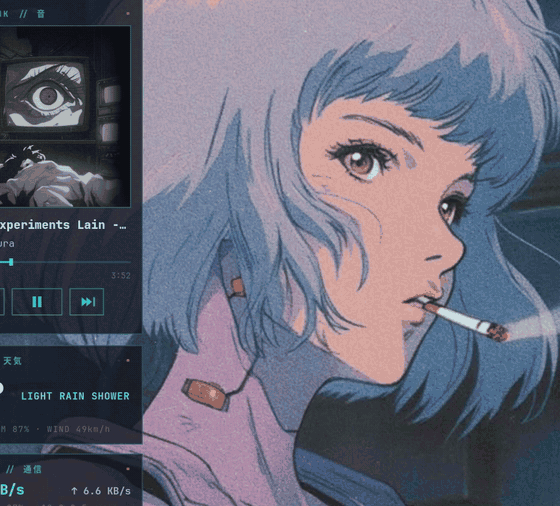


**Desktop:** waybar, widgets (clock, calendar, player, weather, network, battery, load, audio spectrum, to-do). Demo data, no personal info.

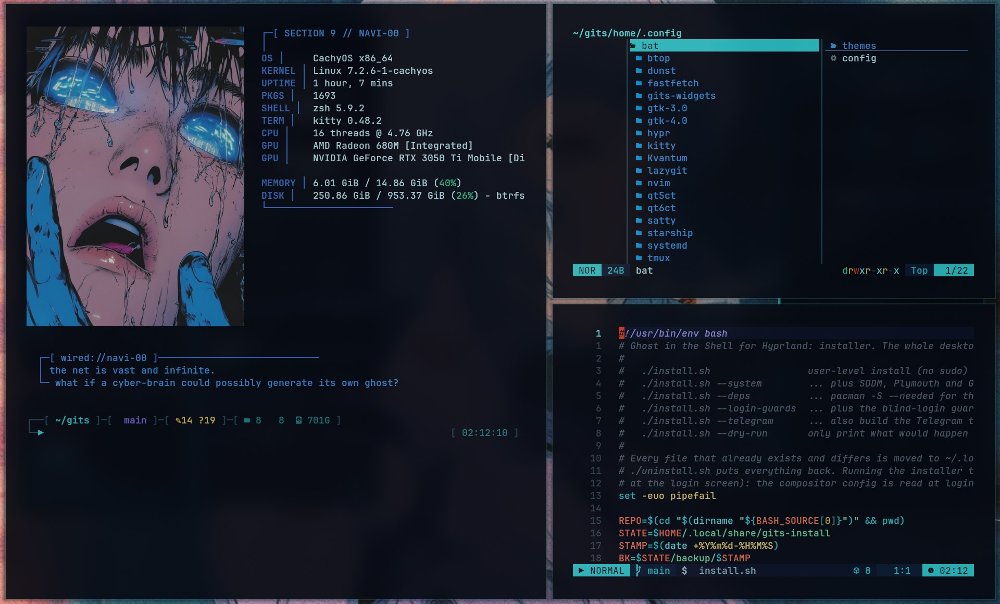
**Tiling** with gaps and neon borders: kitty banner, yazi and Neovim side by side.

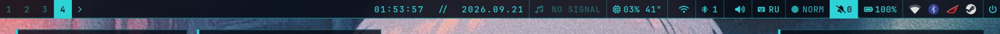
**Bar:** workspaces, clock, player, load and temperature, Wi-Fi, Bluetooth, volume, layout, workflow mode, notification counter, battery, tray, power button.

### Launcher and quick tools
| | |
|---|---|
|  **Launcher** (Super+A): apps (with icons, most used first), settings, projects, windows, notes, calculator, web search in one field | 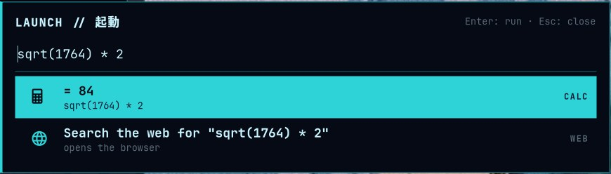 **Calculator** in the same field: `sqrt(1764) * 2`, `2^10`, `pi * 3`; Enter copies the result |
| 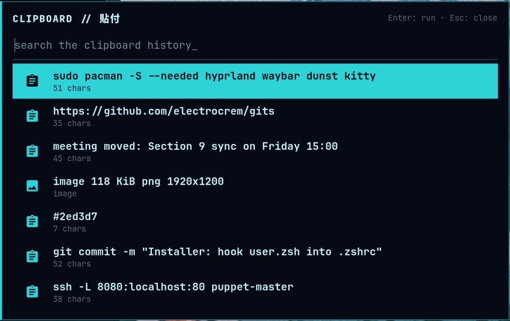 **Clipboard history** (Super+V): text and images | 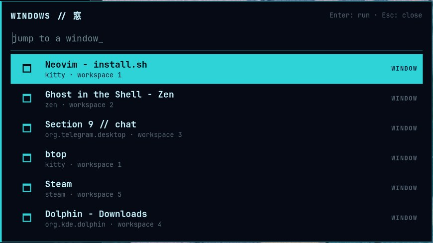 **Window switcher** (Super+Tab), most recent first |
| 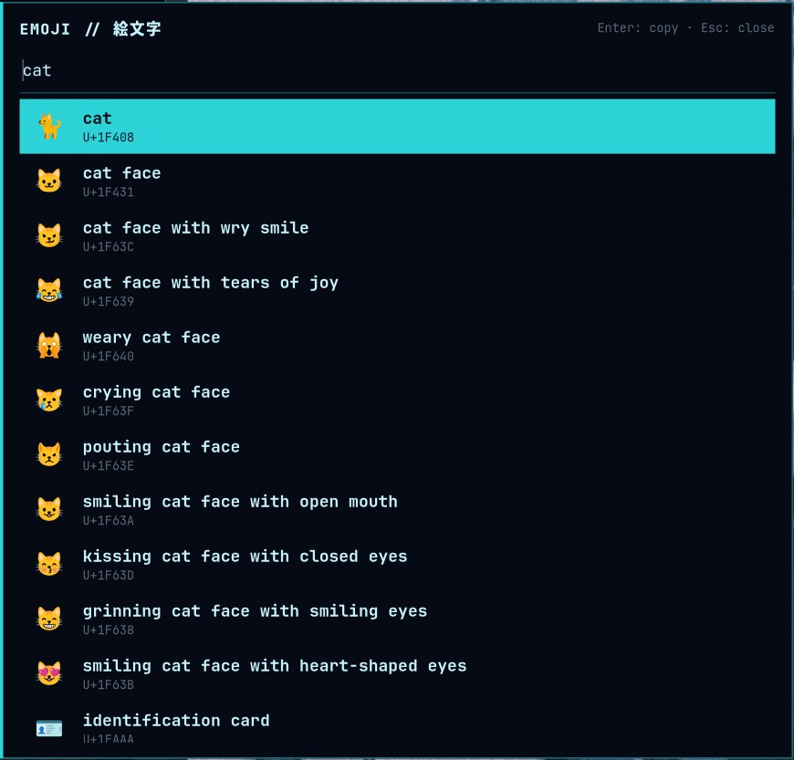 **Emoji and symbol picker** (Super+comma): search by name, Enter copies | 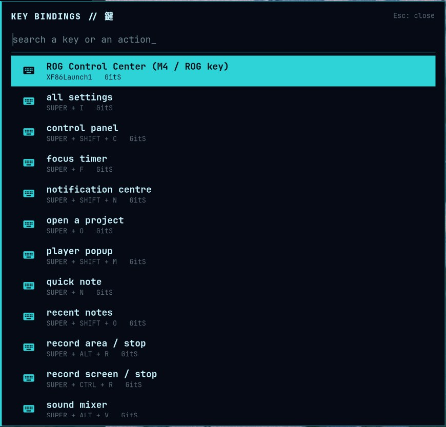 **Key bindings** (Super+slash): every bind with its description, searchable |
| 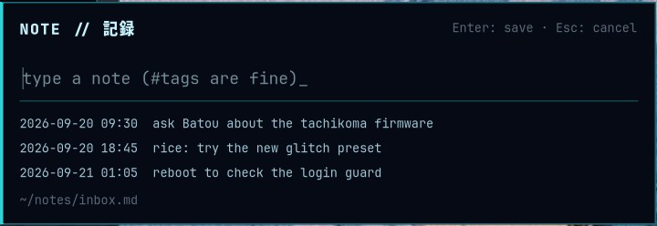 **Quick note** (Super+N) into `~/notes/inbox.md`; Super+Shift+O lists the latest | 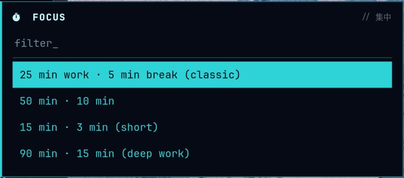 **Focus timer** (Super+F): pomodoro with a counter on the bar |

### Panels and menus
| | |
|---|---|
|  **Control panel** (the power button, Super+Shift+C): toggles, sliders, power profile, charge limit, tools, session, health chip |  **Media popup** (Super+Shift+M) is a carousel: one page per sound source (Spotify, a browser tab, mpv...), the radio last; switch with the arrows, the dots, Left / Right or a two-finger swipe |
| 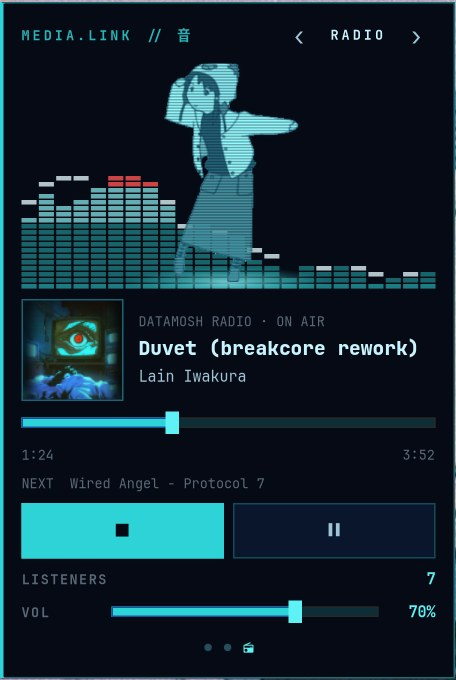 **Radio** (Super+R, the last page of the media popup): Lain dances on the live spectrum of the radio's own stream (faster with the music, frozen on pause), what is on air with its cover, listeners, tune in / out, volume |  **Sound mixer** (Super+Alt+V): master, outputs, one slider per app |
|  **Notification centre** (Super+Shift+N) | 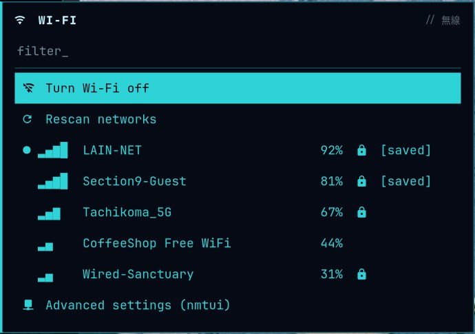 **Wi-Fi menu** (click on the bar icon) |
| 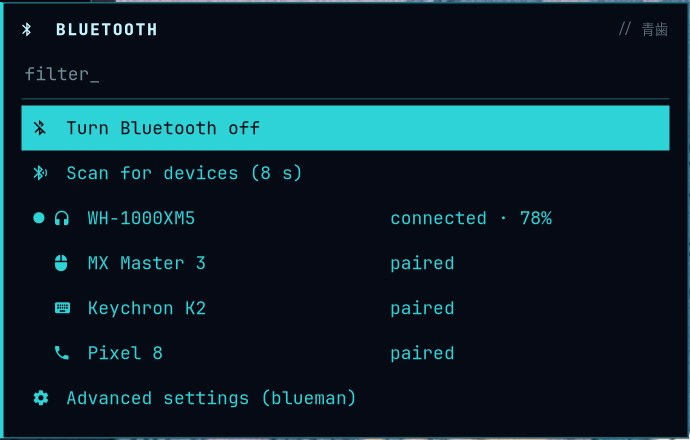 **Bluetooth menu** (click on the bar icon) |  **All settings** (Super+I) |
|  **On-screen display** for volume, brightness, keyboard backlight, touchpad | 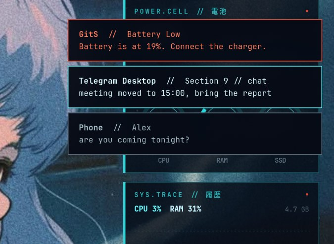 **Notification popups** (dunst): normal, critical and phone notifications |
|  **Power menu** (wlogout) |  |

### Terminal and tools
| | |
|---|---|
|  **Terminal:** kitty banner + fastfetch, starship prompt | 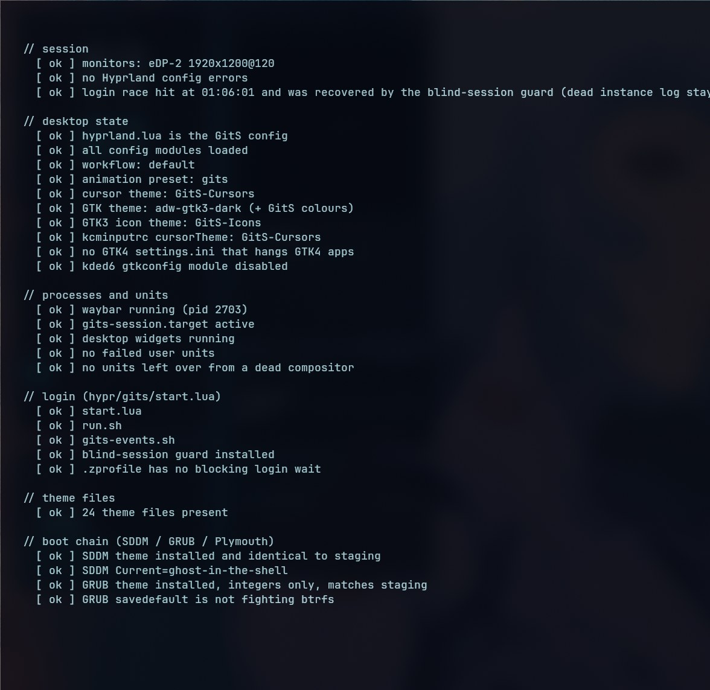 **`gits-doctor`** health report |
|  **Neovim dashboard** |  **Neovim** (LazyVim): colourscheme, lualine, bufferline |
| 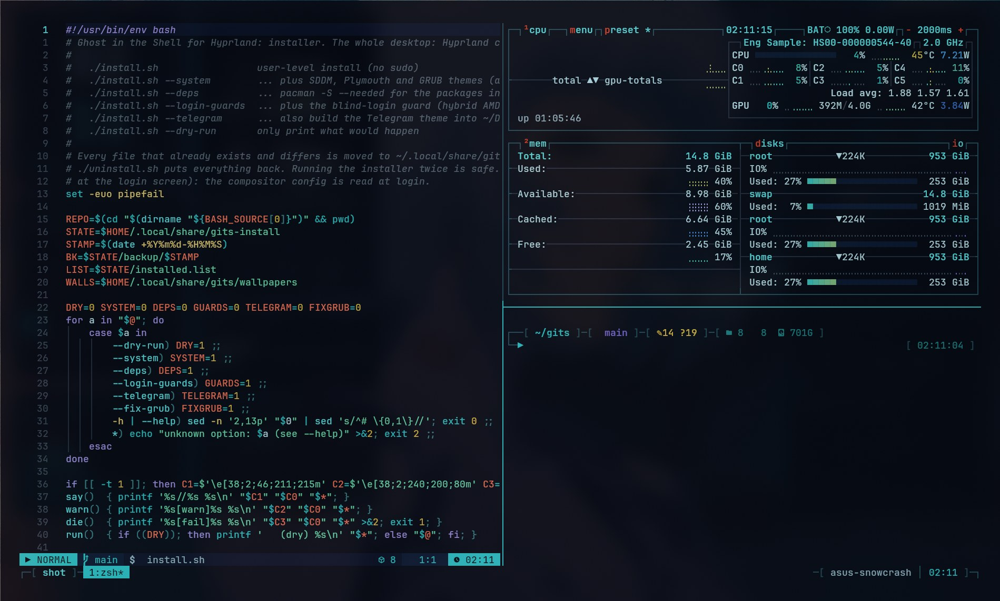 **tmux** themed, with the banner inside a pane | 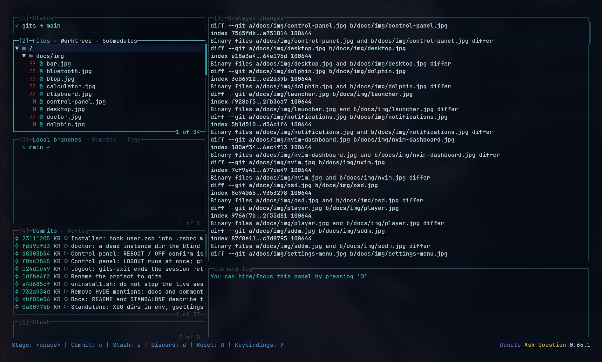 **lazygit** |
| 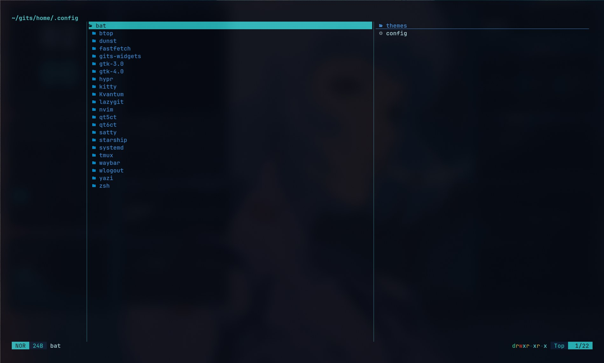 **yazi** | 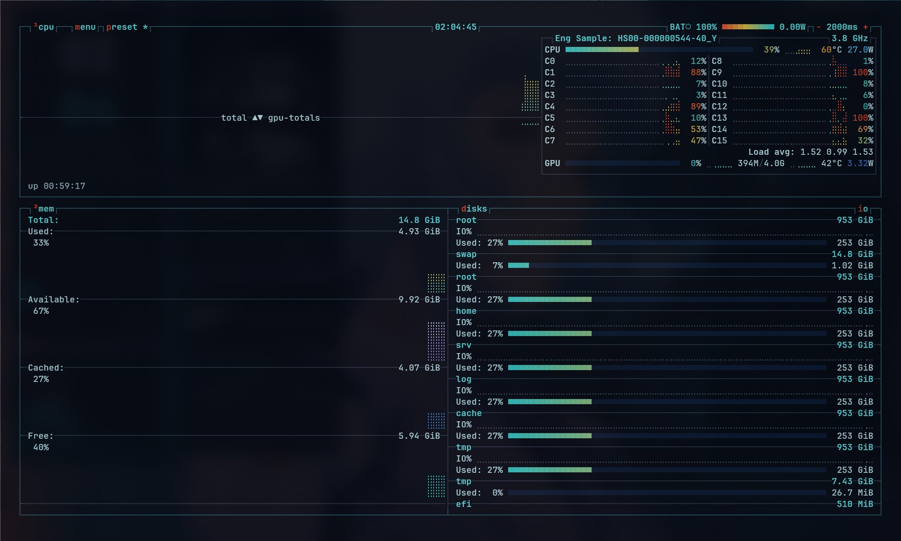 **btop** |

### Apps and login
| | |
|---|---|
|  **Dolphin** (Kvantum) with `GitS-Icons` cyan folders | 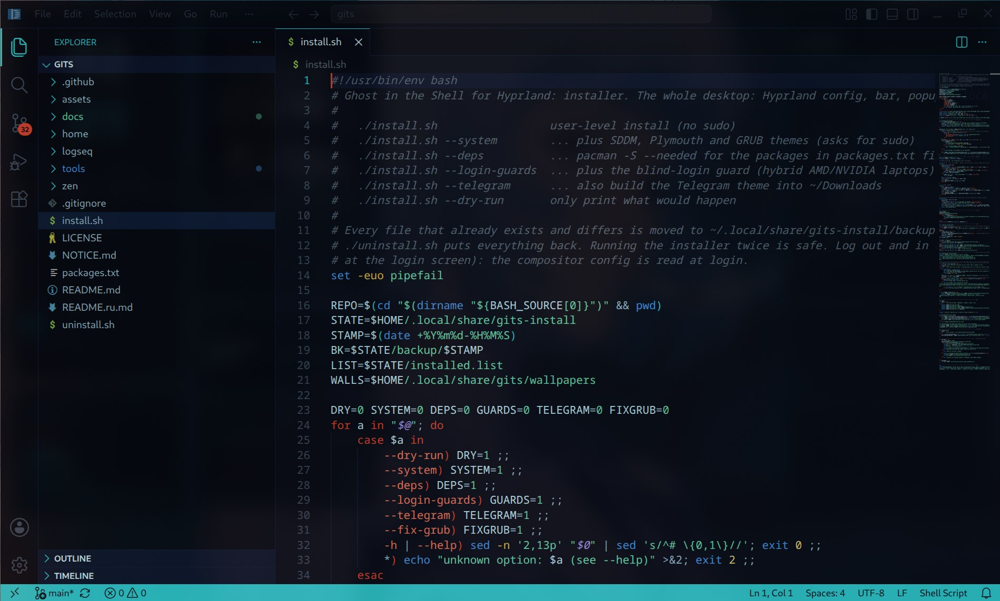 **VS Code / Code-OSS** theme |
|  **SDDM** login (Qt6) |  |

The popups open with a scan-line "power-on" effect (a bright line uncovers the card from the top). The lock screen (hyprlock), Plymouth and GRUB themes,
and the Zen, Logseq and Telegram themes are not pictured: they cannot be screenshotted safely or reliably on a live session (Logseq would open your own notes).
`tools/screenshots.sh` regenerates the pictures and the GIF on an empty workspace with the widgets and popups in their demo modes; it refuses to shoot
the bar while a player is playing, so the title of your music never ends up in a picture.

## Requirements

* Arch-based distro with **Hyprland 0.55+** (the config is Lua). Developed on CachyOS + Hyprland 0.56. Works from a bare Hyprland install; every file the installer
  replaces is backed up (see below).
* Packages: see [`packages.txt`](packages.txt). `./install.sh --deps` installs them. AUR: `bibata-cursor-theme`
  (the cursor builder reuses its alias links) and `tela-circle-icon-theme-grey` (base of the icon theme).

## Install

```bash
git clone https://github.com/electrocrem/gits.git
cd gits
./install.sh --dry-run          # look at what would happen
./install.sh                    # user-level install, no sudo
./install.sh --system           # SDDM + Plymouth + GRUB themes (sudo)
```

Options: `--deps` (pacman), `--login-guards` (blind-login guard for hybrid AMD/NVIDIA laptops), `--telegram` (build the
Telegram theme into `~/Downloads`), `--fix-grub` (see below), `--dry-run`.

Then **log out and in** (Hyprland session): the compositor reads its config at login. To look at it first, inside your current session:
`GITS_NESTED=1 Hyprland -c ~/.config/hypr/hyprland.lua` opens it in a window (no services are started). A module of the config that fails to
load does not stop the others; the error goes to `~/.local/state/gits/config-errors.log` and `gits-doctor` reports it.

Afterwards run `gits-doctor` (read-only): it checks the session, units, config, theme files, the boot chain and Zen.

### What the installer touches

* Copies `home/` into `$HOME` (`@HOME@` becomes your home directory). Anything that already exists and differs is
  moved to `~/.local/share/gits-install/backup/<time>/`.
* Appends marked blocks (`>>> gits:… >>>`) to **your** `~/.config/zsh/user.zsh` and `~/.config/nvim/lua/config/options.lua`.
  Nothing else in those files is changed. If your zsh does not read `user.zsh` by itself (the installer asks zsh, it
  does not guess), one more marked line (`gits:zsh-wire`) is added to the `.zshrc` your shell reads. `uninstall.sh` removes it again.
* Puts the wallpapers in `~/.local/share/gits/wallpapers/`, the session units in `~/.config/systemd/user/`, builds the cursor, icon and
  sound themes. Login sets the GTK theme (adw-gtk3-dark + our colours), icons and cursor through gsettings.
* Recolours `~/.config/kdeglobals` accents, registers the VS Code theme, installs Zen styles into the default
  profile, swaps the stylesheet of the Logseq *Nord* theme plugin (originals are kept).
* `--system` copies the SDDM theme to `/usr/share/sddm/themes`, writes `/etc/sddm.conf.d/zz-gits.conf`, builds and
  installs the Plymouth/GRUB themes (`home/.local/share/gits-boot`, it can `--revert`).

### GRUB "sparse file not allowed" screen

If GRUB prints `error: commands/loadenv.c:check_blocklists:289:sparse file not allowed. Press any key to continue`
on every boot (btrfs root + `GRUB_SAVEDEFAULT=true`), run `./install.sh --fix-grub`. GRUB will then always boot the
first entry instead of the last chosen one. Details in [docs/PITFALLS.md](docs/PITFALLS.md).

## Uninstall

```bash
./uninstall.sh            # restores backups, deletes what was created, removes the appended blocks
```

System-level pieces are left alone; the commands to revert them are printed at the end.

## Layout

```
install.sh / uninstall.sh   installer and its inverse
packages.txt                pacman packages needed
home/                       mirror of $HOME (config files, scripts, extensions)
assets/                     pictures (wallpapers, lock/boot art, banner) — see NOTICE.md
zen/  logseq/               browser and notes-app styles (installed by tools/post.py)
tools/export.py             refresh this repo from your live $HOME (maintainers)
tools/make-assets.py        generates original placeholder artwork when assets/ is incomplete
tools/post.py               idempotent edits: kdeglobals, Logseq, VS Code, Zen
docs/PITFALLS.md            what broke and why
docs/PALETTE.md             the colours
```

## Updating this repo from a live system

```bash
tools/export.py --check     # what differs between $HOME and the repo
tools/screenshots.sh        # retake docs/img + the demo GIF on an empty workspace (demo data, a few minutes, do not touch the mouse; ONLY="player mixer" retakes some)
tools/export.py             # copy it over (explicit manifest, no images except assets/, no backups/caches)
```

## Notes

* Tested end to end on the author's machine (CachyOS, Hyprland 0.56 Lua config, AMD + NVIDIA laptop). The
  installer's file handling (backups, idempotency, uninstall round trip) is tested against a throw-away `$HOME`.
  Boot-time pieces (Plymouth/GRUB) cannot be exercised without a reboot.
* Logseq: only the route through an installed theme plugin is tested. On a fresh Logseq copy
  `logseq/gits.css` to `<graph>/logseq/custom.css`.
* Widget location/weather: `GITS_WEATHER_LOCATION="Berlin"` (default: by IP, `off` disables the request).

## License

Code and configs: MIT, see [LICENSE](LICENSE). The pictures in `assets/` and third-party files are **not** covered by it,
see [NOTICE.md](NOTICE.md).
