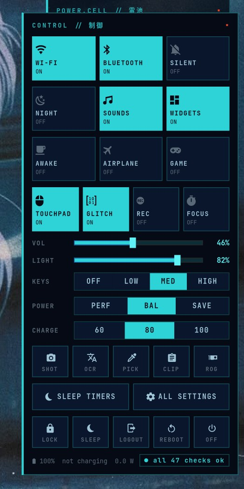
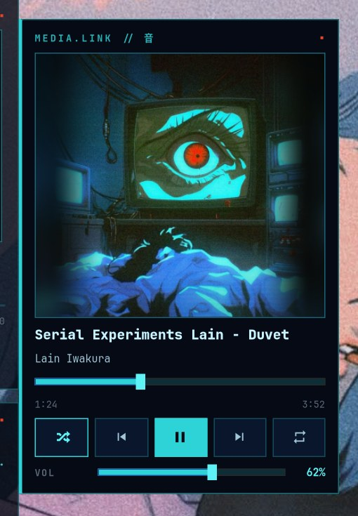
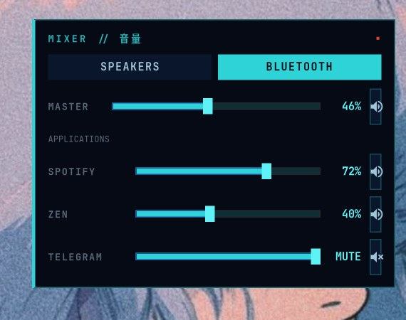
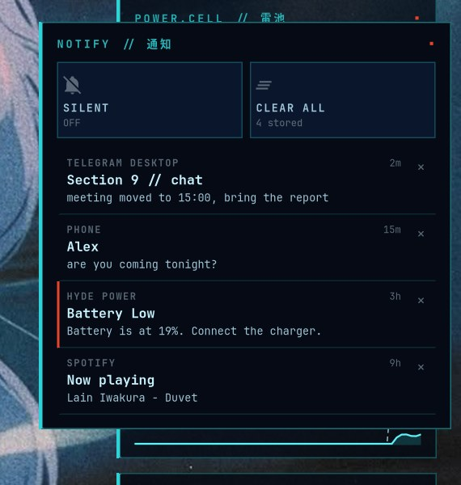
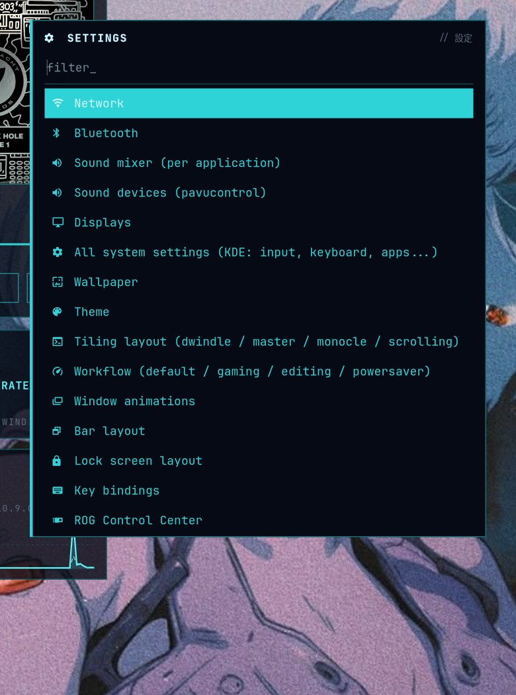
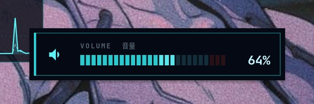

# gits-hyde — «Призрак в доспехах» для Hyprland

Самодостаточный рабочий стол в стиле *Ghost in the Shell* для Hyprland (Lua-конфиг, 0.55+), без HyDE и других фреймворков
(начинался как тема для [HyDE](https://github.com/HyDE-Project/HyDE) и постепенно заменил все его части):
тёмно-синяя палитра с циановым «люминофором», квадратные углы, тонкие рамки, иероглифы-метки.
Один установщик, один деинсталлятор, каждый заменённый файл сохраняется в бэкап. [English version](README.md)

## Что внутри

Свой конфиг Hyprland (`~/.config/hypr/gits/*.lua`: бинды, правила, 4 раскладки, 5 workflow, анимации `gits`), сервисы сессии как systemd-юниты, waybar (свой макет, переключатель workflow), виджеты рабочего стола (часы, календарь, плеер, погода,
сеть, батарея, нагрузка, to-do, визуализатор звука, редкие глитчи на обоях), hyprlock, темы SDDM / Plymouth / GRUB, GTK-лаунчер (Super+A), буфер обмена, переключатель окон, эмодзи и меню (действия уведомлений, Wi-Fi, Bluetooth, профиль питания), звуки интерфейса, всплывающие панели (управление, плеер, центр уведомлений), OSD громкости/яркости/подсветки, dunst,
wlogout, терминал (баннер с картинкой, в том числе внутри tmux; автозапуск tmux по желанию: `export GITS_TMUX=1`; starship, fzf, bat, btop, lazygit, tmux, yazi), курсор `GitS-Cursors`, Neovim, VS Code, Zen,
Logseq, Qt/Dolphin (Kvantum), сборщик темы Telegram, а также `gits-doctor` — отчёт о состоянии системы и опциональная настройка снапшотов btrfs.

## Галерея


| | |
|---|---|
|  панель управления (кнопка питания, Super+Shift+C) |  плеер (Super+Shift+M) |
|  микшер (Super+Alt+V) |  центр уведомлений (Super+Shift+N) |
|  все настройки (Super+I) |  OSD громкости, яркости, подсветки, тачпада |
|  баннер терминала |  заставка Neovim |
|  Neovim |  лаунчер |
|  меню выключения |  экран входа SDDM |
|  Dolphin с циановыми папками |  Logseq |

Окна открываются эффектом «сканирования»: яркая линия проявляет карточку сверху вниз. Экран блокировки, Plymouth и GRUB не показаны: их нельзя безопасно
снять на живой сессии. `tools/screenshots.sh` переснимает картинки выше на пустом воркспейсе с демо-данными.

## Установка

```bash
git clone https://github.com/electrocrem/gits-hyde.git && cd gits-hyde
./install.sh --dry-run          # посмотреть, что будет сделано
./install.sh                    # установка на уровне пользователя, без sudo
./install.sh --system           # темы SDDM + Plymouth + GRUB (нужен sudo)
```

Ключи: `--deps` (поставить пакеты pacman'ом), `--login-guards` (защита от «слепого» входа на ноутбуках с AMD+NVIDIA),
`--telegram` (собрать тему Telegram в `~/Downloads`), `--fix-grub` (см. ниже), `--dry-run`.

Затем **выйдите и войдите заново** (сессия Hyprland): конфиг компоситора читается при входе. Посмотреть его заранее можно прямо в
текущей сессии: `GITS_NESTED=1 Hyprland -c ~/.config/hypr/hyprland.lua` (окно внутри окна, сервисы не запускаются). Если модуль конфига не
загрузился, остальные работают, а ошибка попадает в `~/.local/state/gits/config-errors.log` (и в `gits-doctor`).

**Переходите с HyDE?** Установщик заменяет `~/.config/hypr/hyprland.lua` и конфиги hyprlock/hypridle/dunst/kitty/GTK/Qt (всё в бэкап).
Скрипт входа HyDE `~/.local/lib/hyde/shell/activate` (его подключает zsh-конфиг HyDE) экспортирует `HYPRLAND_CONFIG=~/.local/share/hypr/hyde.lua`,
и Hyprland загрузит конфиг HyDE: переименуйте этот файл до входа. После этого HyDE ничем здесь не используется и его можно удалить.

После установки запустите `gits-doctor`: он ничего не меняет, только проверяет.

### Экран GRUB «sparse file not allowed»

Если при каждой загрузке GRUB пишет `error: commands/loadenv.c:check_blocklists:289:sparse file not allowed. Press any key
to continue` (корень на btrfs и `GRUB_SAVEDEFAULT=true`), выполните `./install.sh --fix-grub`. GRUB будет всегда грузить
первую запись, а не последнюю выбранную. Подробности в [docs/PITFALLS.md](docs/PITFALLS.md).

## Удаление

```bash
./uninstall.sh        # вернёт бэкапы, удалит созданное, уберёт добавленные блоки
```

Системные части (SDDM, GRUB, Plymouth) не трогаются: команды для отката печатаются в конце.

## Лицензия

Код и конфиги — MIT. Картинки из `assets/` и сторонние файлы ей **не покрываются**, см. [NOTICE.md](NOTICE.md).
